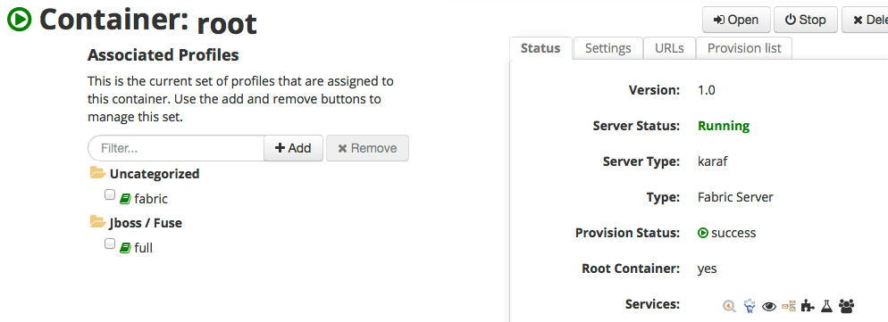

# Deploy with Fuse Fabric
JBoss Fuse has a fantastic management capability leveraging Fuse Fabric. Please take a look at the documentation on RedHat.com for more detail about Fuse Fabric, but for a quick bullet point summary, here's what fabric is/does:

Fabric is a microservices deployment/management platform for JBoss Fuse. It gives the following functionality:

* Centralized configuration management
* Service/module versioning
* Rolling deployments/rollbacks
* Audit capabilities of what changed in the environment
* Service discover
* Load balancing
* Failover
* Master/Slave elections
* more......

## Getting started with Fabric
Before we let Fuse Fabric manage our deployments, let's first create a Fabric container. If you don't have fuse running yet, navigate to the root directory and run:

    ./bin/fuse
    
At the shell that Fuse starts up, run this command:

    JBossFuse:karaf@root> fabric:create --clean --wait-for-provisioning 
    
Wait a few moments for the JVM to transform into a fabric container. Once that's happened, navigate over to `http://localhost:8181` and login with `admin/admin`. You should see a screen similar to this (click "containers" tab if you're greeted with the welcome page first):

> Note, the intention isn't to go super deep with what Fabric is or how it works. Feel free to tweet me `@christianposta` or open an issue for this repo with the detail you feel would be useful to make the flow of this POC work better

Click on the `Wiki` tab which will show you a list of `profiles` or "applications" that we can deploy:

Feel free to poke around and see what default applications/profiles exist out of the box.

### Disable fuse-full
When we first start up a fabric, the "root" node which holds all of the magic used by fabric to manage, configure, and version JVM containers and deployments will also be running a JBoss Fuse set of applications (ActiveMQ, CXF, camel, etc). But for the "root" node, we don't want to burden it with those things, so let's remove those pieces. With Fuse Fabric, removing functionality/modules/applications is as simple as removing profiles. Clikc the "containers" tab, then click the "root" container. You should see a screen like this:

Click the "full" profile and click "Remove" Wait a few moments for the root container to uninstall and re-provision itself. You may also be forced to login again. Go back and check to verify that the "full" profile was removed from the "root" container (note, due to a bug in JBoss Fuse 6.2, i had to remove that "full" profile multiple times for it to get to work :) )

Once "full" profile is removed, let's click on "services" tab and then "MQ". We are going to deploy a set of ActiveMQ brokers and use the centralized configuration management to make some changes to the default broker so it works well with our use case.