# Getting Started

To get started, clone this repository to your local machine and use your favorite tools to dig in deeper.

### Prerequisites
You'll need the following software to complete this POC:

* [JBoss Fuse 6.2](http://www.jboss.org/products/fuse/download/)
* [Maven 3.2.x](http://archive.apache.org/dist/maven/maven-3/3.2.5/)
* [Git](https://git-scm.com/downloads)
* [JBoss Developer Studio](http://www.jboss.org/products/devstudio/download/)
* [HL7 Test Panel](http://hl7api.sourceforge.net/hapi-testpanel/) -- optional 

### Command line
Navigate to directory where you want to clone this project:
    
    cd $proj_root
    git clone git@github.com:christian-posta/healthcare-poc.git
    cd healthcare-poc
    
Now run maven to build the project:

    mvn clean install 
    
Things should compile, the tests should run (successfully!) and you should end up with a terminal like this:

    [INFO] --- maven-install-plugin:2.4:install (default-install) @ stub-services ---
    [INFO] Installing /Users/ceposta/dev/poc/CHOP/workspace/hl7-example/stub-services/target/stub-services-1.0.0-SNAPSHOT.jar to /Users/ceposta/.m2/repository/org/jboss/fuse/examples/stub-services/1.0.0-SNAPSHOT/stub-services-1.0.0-SNAPSHOT.jar
    [INFO] Installing /Users/ceposta/dev/poc/CHOP/workspace/hl7-example/stub-services/pom.xml to /Users/ceposta/.m2/repository/org/jboss/fuse/examples/stub-services/1.0.0-SNAPSHOT/stub-services-1.0.0-SNAPSHOT.pom
    [INFO] ------------------------------------------------------------------------
    [INFO] Reactor Summary:
    [INFO] 
    [INFO] Health Care POC: Parent POM ....................... SUCCESS [0.120s]
    [INFO] Health Care POC: Features XML File ................ SUCCESS [0.164s]
    [INFO] Health Care POC: Ingress of HL7 Messages .......... SUCCESS [3.917s]
    [INFO] Health Care POC: Consumer 1 of HL7 Messages ....... SUCCESS [1.911s]
    [INFO] Health Care POC: Transformer 1 .................... SUCCESS [1.338s]
    [INFO] Health Care POC: Stub services .................... SUCCESS [0.616s]
    [INFO] ------------------------------------------------------------------------
    [INFO] BUILD SUCCESS
    [INFO] ------------------------------------------------------------------------
    [INFO] Total time: 8.730s
    [INFO] Finished at: Mon Oct 05 12:59:29 MST 2015
    [INFO] Final Memory: 52M/1141M
    [INFO] ------------------------------------------------------------------------


### Using JBDS
To checkout and build with JBDS, go to `File-->Import` and choose the `Existing maven project from SCM` option. In the first dialog, enter the project git URL `https://github.com/christian-posta/healthcare-poc` and click `Finish` JBDS should then proceed to clone and build the source code.

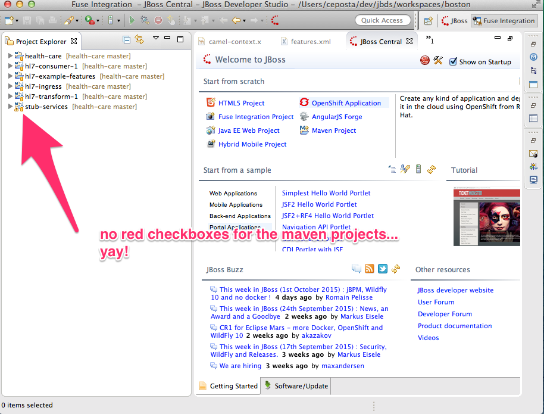


## Explore the project

We now have the project checked so let's explore it. Here are all of the projects that were imported into the IDE:

* `health-care` -- this is the top-level parent project
* `hl7-consumer-1`  -- able to marshal HL7 payloads and send to downstream systems, EHR, etc
* `hl7-example-features` -- generates a Karaf features file so we can deploy all the pieces into a Fuse JVM
* `hl7-ingress` -- an MLLP/HL7 collector of events; it exposes an HL7 endpoint and unmarshalls an HL7 payload
* `hl7-transform-1` -- able to transform HL7 payloads from one message to another
* `stub-services` -- Set of stub services that expose HL7 endpoints that can return NACK messages

If we navigate to the `hl7-ingress` project and open the `src/main/resources/META-INF/spring/camel-context.xml` file we should see the Fuse tooling display the route(s) using a visual notation. (Note, if you don't see the visual camel diagrams, make sure to install the Integration Stack as [described on the JBDS getting started page](http://www.jboss.org/products/devstudio/get-started/#!project=devstudio). 

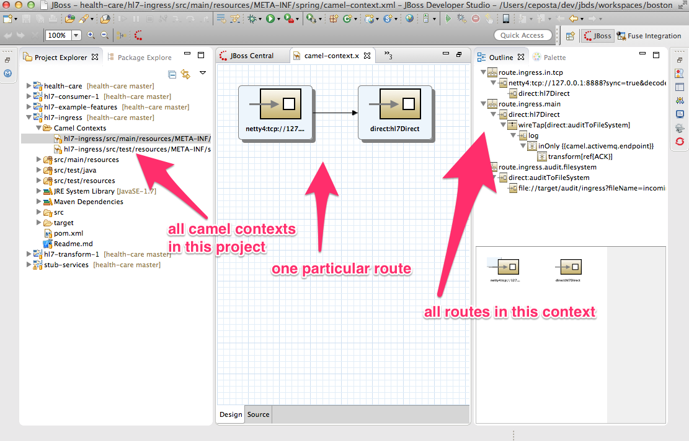

Using the outline view off to the right, select the "main" route and you should see a diagram like this:

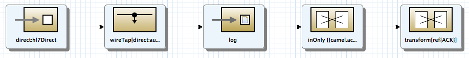

### Unit Tests
Camel has a [set of extensive testing modules](http://camel.apache.org/testing.html) that are very useful (and important) for building out critical integration paths. We can use the test framework to set expectations on routes, simulate exceptions and correct route behavior in failure scenarios. 

Start by navigating to `src/test/java`  in the `hl7-ingress` project and you should see a unit test named `HL7IngressRouteTest.java`. This test shows a number of things:

#### Running the unit tests with spring support using `@ContextConfiguration` and `@RunWith` annotations

```java
    @RunWith(CamelSpringJUnit4ClassRunner.class)
    @ContextConfiguration({"classpath*:/META-INF/spring/*.xml"})
    public class HL7IngressRouteTest {
```
    
    
#### [Injecting Camel endpoints and producer templates](http://camel.apache.org/pojo-producing.html) using Camel's `@Produce` and `@EndpoingInject` annotations

```java
    @Autowired(required=true)
    private CamelContext testRoutes;

    @Autowired(required=true)
    private CamelContext ingressCamel;

    @Produce(uri = "netty4:tcp://127.0.0.1:8888?sync=true&decoder=#hl7decoder&encoder=#hl7encoder")
    private ProducerTemplate hl7TcpProducer;

    @EndpointInject(uri = "mock:messagingMock")
    private MockEndpoint messagingMock;

    @EndpointInject(uri = "mock:fileMock")
    private MockEndpoint fileMock;
```

#### How to bootstrap a **lightweight** ActiveMQ instance, useful for testing (and how to gracefully shut down)

```java
    @BeforeClass
    public static void bootActiveMQ() throws Exception {
        broker = new BrokerService();
        broker.addConnector("tcp://localhost:61616");
        broker.setPersistent(false);
        broker.deleteAllMessages();
        broker.start();
        broker.waitUntilStarted();
    }
    
    @AfterClass
    public static void stopActiveMQ() throws Exception {
        if (broker != null) {
            broker.stop();
            broker.waitUntilStopped();
        }
    }        
```     

#### How to set expectations on the route and assert them at the end of the test

```
    @Test
    public void testHl7TcpRouteValidMessage() throws Exception {

        messagingMock.expectedMessageCount(1);
        fileMock.expectedMessageCount(1);
        NotifyBuilder notify = new NotifyBuilder(ingressCamel).whenCompleted(2).create();
        String resp = hl7TcpProducer.requestBody((Object) createValidHl7Message(), String.class);
        assertNotNull(resp);
        assertThat(resp, containsString("MSA|AA|MSGID12349876"));
        notify.matches(2, TimeUnit.SECONDS);

        MockEndpoint.assertIsSatisfied(testRoutes, 2, TimeUnit.SECONDS);

    }
```

You should try to run this test by right clicking the class and select `RunAs-->Junit Test`

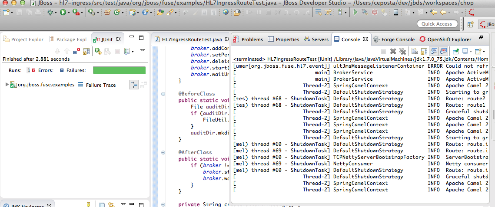

### Running routes stand-alone (outside of fuse)

We can also run these routes outside of a container using the tooling (or the built in mvn camel plugin). Unit tests are the first source of testing and should not be overlooked. We can get 90% of the functionality correct just by using unit tests. But there will be scnarios that will require you to run the adapters and routing engine outside of a unit test to get a better idea of how the integration points interact in a real scenario. Most folks would prefer to just deploy to a JVM container at this point, but with Camel we could do that or we can run stand alone. 
  
Right click the `camel-context.xml` go to `RunAs-->Local Camel Context (without tests)` 

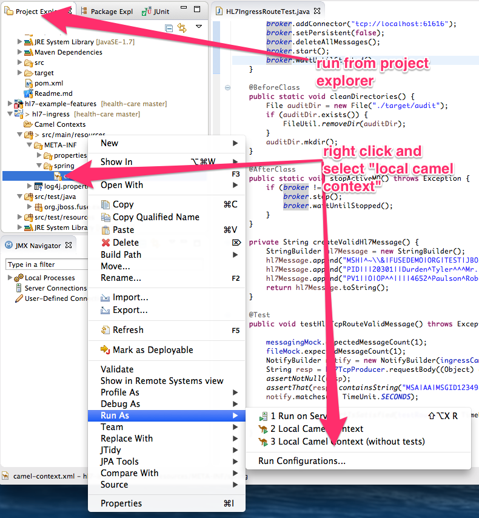

We should see the console spit out some messages like this (which let us know everything is running correctly and bound to the correct ports):

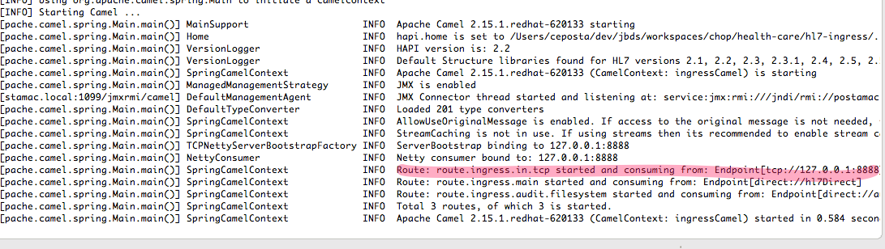

Now let's send a test message! Open up the [HL7 Test Panel](http://hl7api.sourceforge.net/hapi-testpanel/) and generate a new test message. Also start a new "sending connections" session and use port `8888` which is where our camel route is listening. Then click send:

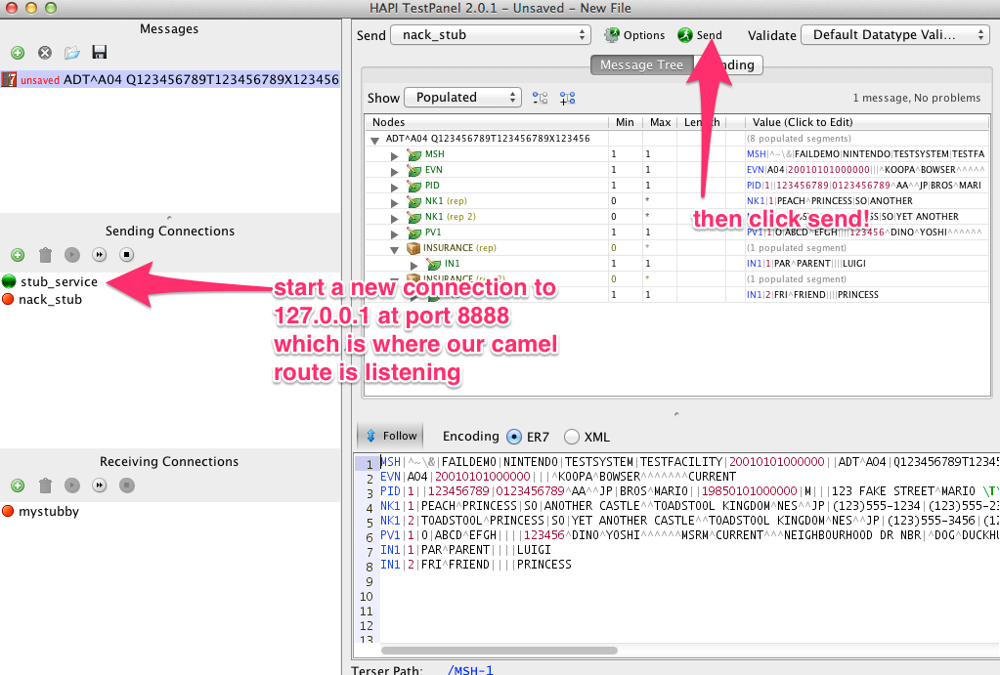

We should see this test fail like this from the Test Panel:

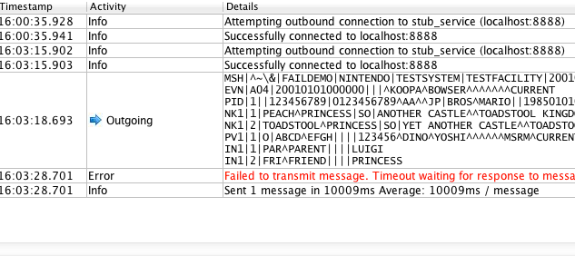

Go inspect the logs in the JBDS console.... Why did this fail?

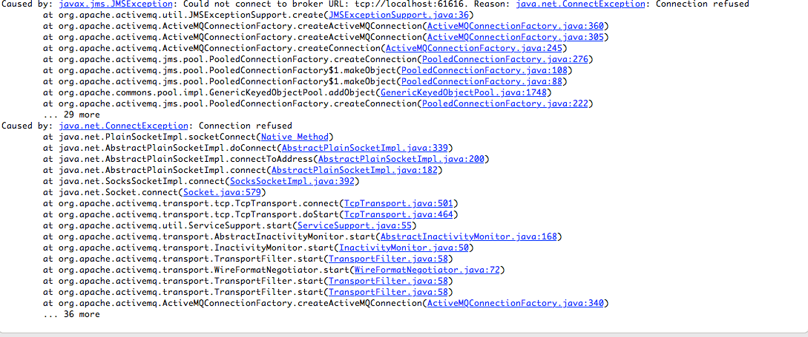

Looks like we don't have ActiveMQ up and running!! This route tries to unmarshal an HL7 message and enqueue it onto an ActiveMQ queue, but we don't have a queue up and running. 
 
Let's start up JBoss Fuse 6.2, which does have ActiveMQ running inside. Navigate to where you've installed JBoss Fuse and run:

    ./bin/fuse

You'll have a successfully running Fuse shell if things went well:

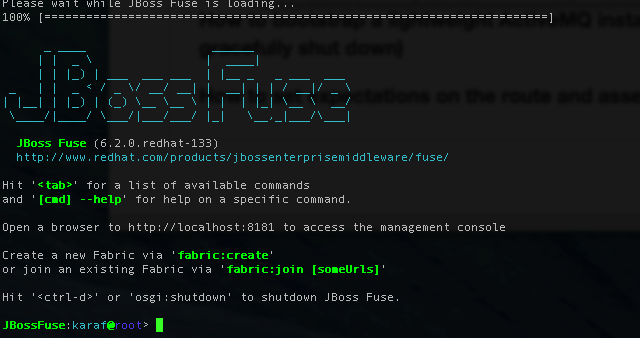

Now try the test again from the HAPI Test Panel:

We should now see the outbound and inbound (request/reply working) from the test panel:

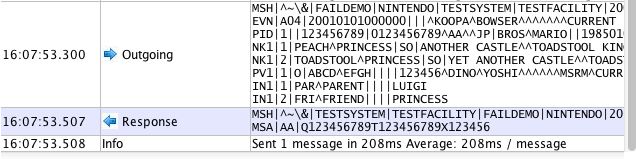

Double check the logging in the console. We should see the message logged correctly. We should also see in the `./target/audit/ingress` folder of the `hl7-ingress` project that an audit file with the correct HL7 document was logged correctly:


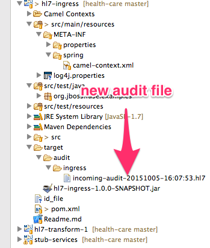

## Deploy into fuse
We've seen the unit tests working and running the `hl7-ingress` routes working outside of the container. Let's use the Karaf features file and install into a running container.

From the fuse shell type the following:

    features:addurl mvn:org.jboss.fuse.examples/hl7-example-features/1.0.0-SNAPSHOT/xml/features
    features:install hl7-example-all
    
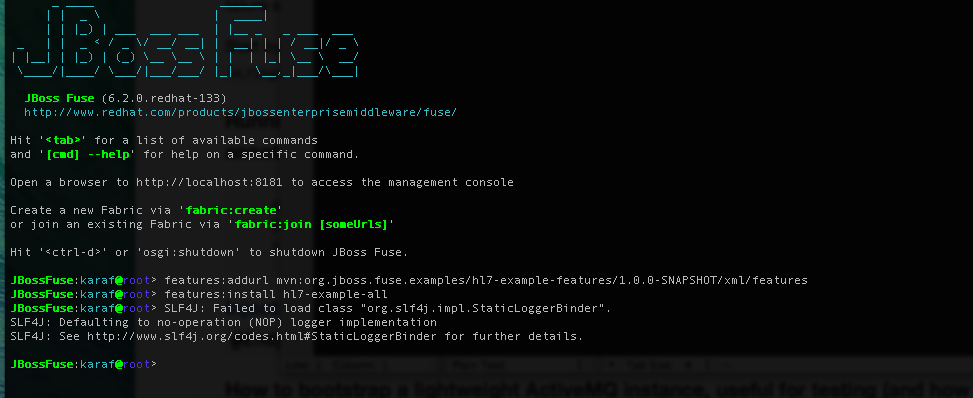    

Yay, you did it! Actually you've installed all modules of this application (ingress, transformation, consumption). Run this command from the Fuse shell to see the installed modules:

    list
    
You should see this:

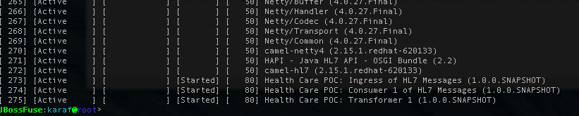

Try running the test from the HAPI Test Panel again. Now navigate to `http://localhost:818` to login to the Fuse web console. Use the password `admin/admin` to gain access. 

> Note: you'll need to uncomment the last line in the users.properties file in $FUSE_HOME/etc/users.properties by default to gain access using admin/admin

Explore the "ActiveMQ" tab and the queues/topics involved. You should see some destinations have enqueued the HL7 messages from our test.

We will dive deeper into this section when [we dig into Fabric deployments](deploy-fabric.md)